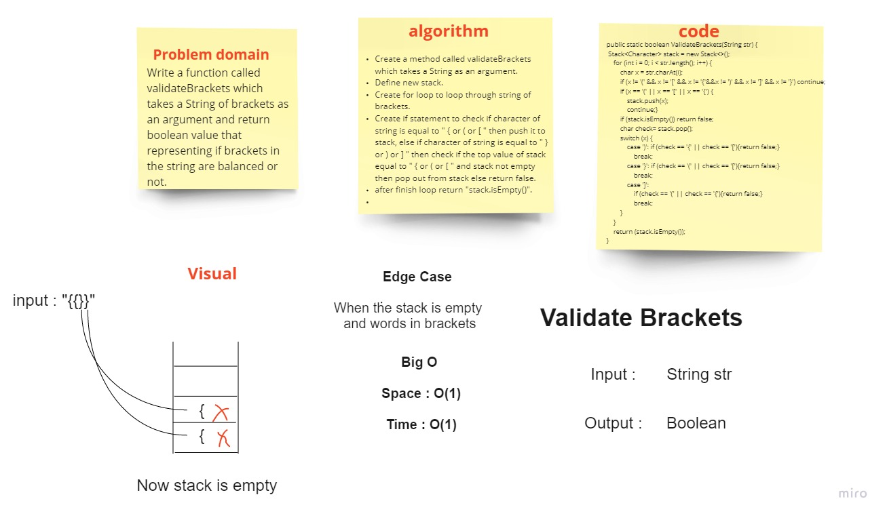

# **Stacks and Queues**

* **Stack** is a linear data structure in which elements can be inserted and deleted only from one side of the list, called the top. A stack follows the *LIFO* (Last In First Out) principle.The insertion of an element into stack is called ***push*** operation, and deletion of an element from the stack is called ***pop*** operation.

* **Queue** is a linear data structure in which elements can be inserted only from one side of the list called rear, and the elements can be deleted only from the other side called the front. The queue data structure follows the FIFO (First In First Out) principle.The insertion of an element in a queue is called an ***enqueue*** operation and the deletion of an element is called a ***dequeue*** operation.

## **Challenge**

*This challenge about how to build and using the **Stack** and **Queue** to store nodes in it and also how to apply methods on it like *push* method to delete node in stack and *dequeue* to delete node in queue.*

## **Approach & Efficiency**

### Space: O(1)

### Time: O(1)

## **API**

###  Methods in Stack

* ` push(int value)` : To add new node in the stack.

* `pop()`: Removes the node from the top of the stack.

* `peek()` : Returns Value of the node located at the top of the stack.

* `isEmpty()` : Boolean indicating whether or not the stack is empty.

###  Methods in Queue

* `enqueue(int value)`: To add new node in the queue.

* `dequeue()` : Removes the node from the front of the queue.

* `peek()`  : Returns Value of the node located at the front of the queue.

* `isEmpty()` : Boolean indicating whether or not the queue is empty.

# Challenge Summary

First-in, First out Animal Shelter.

## Challenge Description

Need add the following methods:

* `enqueue(Animal)`
  this method should add an Animal (Dog OR Cat) into the queue which represents the Animal shelter.
* `dequeue(pref)`
  this method should retrieve the pref type of Animal (Dog Or Cat) which enter the queue first.

## Approach & Efficiency

* ***enqueue(Animal):***
    * Will act the same ad  the enqueue method of the queue which we already have.

* ***dequeue(pref):***

1. will compare if the pref value is a dog and if the front animal is dog => then return this animal
2. OR if the pref value is a cat nad if the front animal is a cat => return this animal

* Else, while the next node not null:
  check again the steps `1,2` but with the value of the `next node` .
* if the loop done without find any mathced value.. return null.

## Solution

# Challenge Summary

the function should take a string as its only argument, and should return a boolean representing whether or not the brackets in the string are balanced.

## Challenge Description

Need add the following method:

* `BracketValidation(input)`
  this method should take an input as a string.. and check if this string is balanced or not.

* Balanced mean each open bracket inside the string must has an appropriete close bracket.
  the bracket types:

* Round Brackets : `()`
* Square Brackets : `[]`
* Curly Brackets : `{}`

## Approach & Efficiency

* take the string as input.
* create an empty stack
* declare regex pattern for ( openBrackets, closeBrackets, matchBrackets)
* loop over each character of the input string
* if the character is open bracket.. push it into the stack
* else if the character is a close bracket :
  * if the class is empty => return false
  * else, pop the top char in the class
  * concatenate it with the current char (which the current loop is on it)
  * check if this pair of brackets is matched or not
  * if matched => continue to next iteration
  * if not => return false
* when the loop finish iterating.
* if the stack is empty => return true
* else => return false.

## Solution

