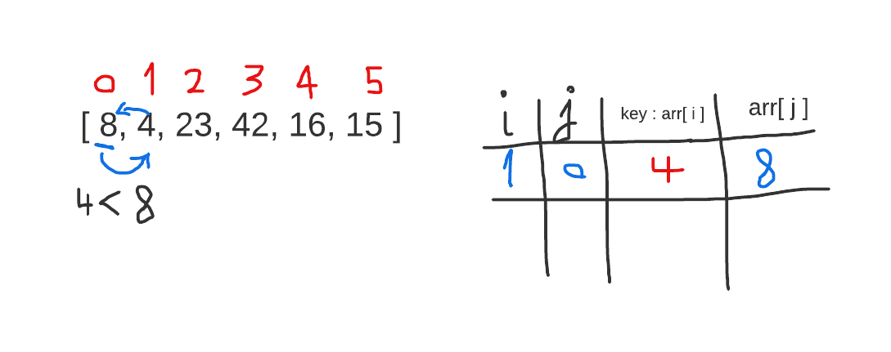
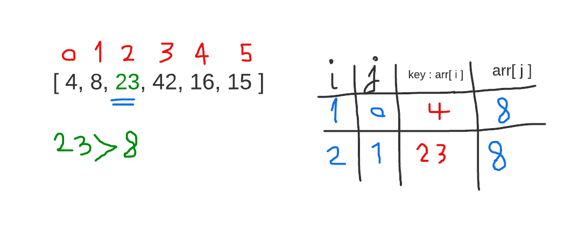
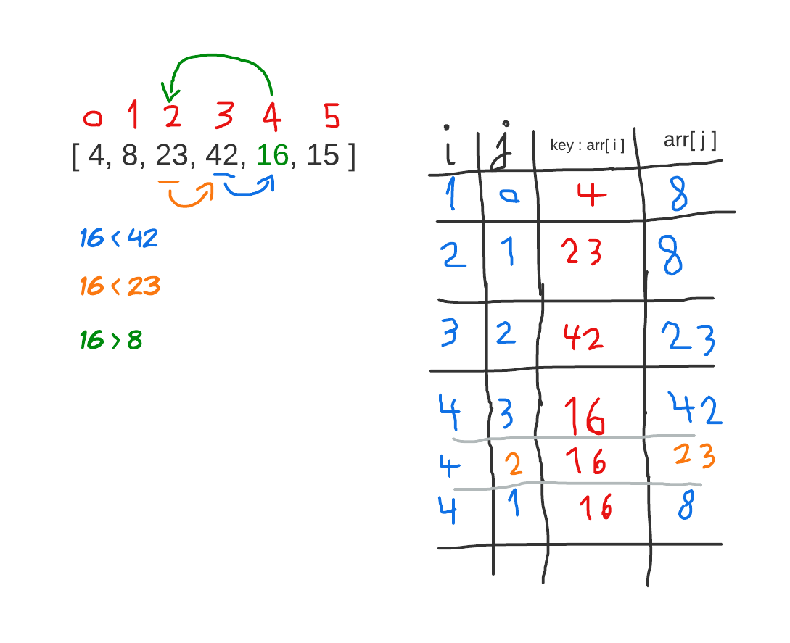
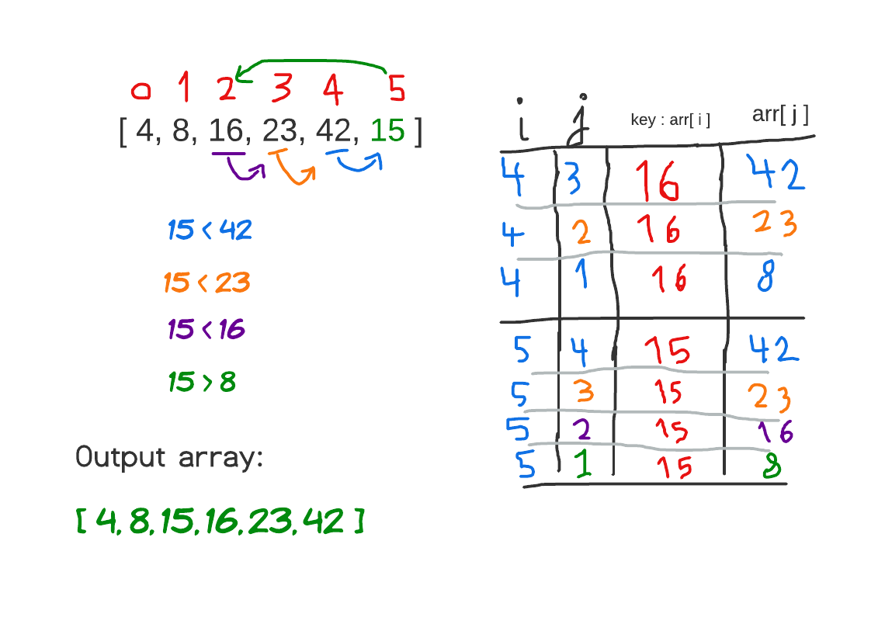

# Insertion Sort Blog

## In this article will trace and explain how insertion sort works:

## Insertion Sort: 

Insertion sort is a simple sorting algorithm that works similar to the way you sort playing cards in your hands. The array is virtually split into a sorted and an unsorted part. Values from the unsorted part are picked and placed at the correct position in the sorted part.


## Pseudocode:
```
InsertionSort(int[] arr)
  
    FOR i = 1 to arr.length
    
      int j <-- i - 1
      int temp <-- arr[i]
      
      WHILE j >= 0 AND temp < arr[j]
        arr[j + 1] <-- arr[j]
        j <-- j - 1
        
      arr[j + 1] <-- temp
```

## Trace:

Sample Array: `[8,4,23,42,16,15]`

loop on the array starting from index number 1:

### step 1:



* start from the second element and consider it as the key which is 4
* compare the key which all previous elements which in this step just 8
* 8 is grater than 4.. then shift 8 one position to the right.
* there is no more elements to compare.. insert the key in the index 0.


### step 2:


* set the value in the index 2 as the key which is equal to 23
* compare the key which all previous elements which are this step  8, 4.
* 23 is grater than 8.. so, no need for shift any element and no need to continue comparing with the previous elements of 8 because they are already sorted.
* keep the key in its position and go to the next iteration.


### step 3:


* set the value in the index 3 as the key which is equal to 42
* compare the key which all previous elements which are this step  23, 8, 4.
* 42 is grater than 23.. so, no need for shift any element and no need to continue comparing with the previous elements of 23 because they are already sorted.
* keep the key in its position and go to the next iteration.


### step 4:



* set the value in the index 4 as the key which is equal to 16
* compare the key which all previous elements which are this step  42, 23, 8, 4.
* 42 is grater than the key (16).. then shift 42 one position to the right.
* 23 is grater than the key (16).. then shift 23 one position to the right.
* 16 is grater than 8.. so, no need for shift any element more and no need to continue comparing with the previous elements of 8 because they are already sorted.
* keep the key in its position and go to the next iteration.


### step 5:



* set the value in the index 5 as the key which is equal to 15
* compare the key which all previous elements which are this step  42, 23, 16, 8, 4.
* 42 is grater than the key (15).. then shift 42 one position to the right.
* 23 is grater than the key (15).. then shift 23 one position to the right.
* 16 is grater than the key (15).. then shift 16 one position to the right.
* 15 is grater than 8.. so, no need for shift any element more and no need to continue comparing with the previous elements of 8 because they are already sorted.
* keep the key in its position and go to the next iteration.


#### finish:

***The output (sorted) array will be:***
`[4,8,15,16,23,42]`


## Efficency

Time: `O(n^2)`
The worst case of this algorithm when the array is sorted in reversed way.. so each element will iterate on all the previous elements and compare and shift them.

Space: `O(1)`
No additional space is being created. This array is being sorted in place…keeping the space at constant `O(1)`.