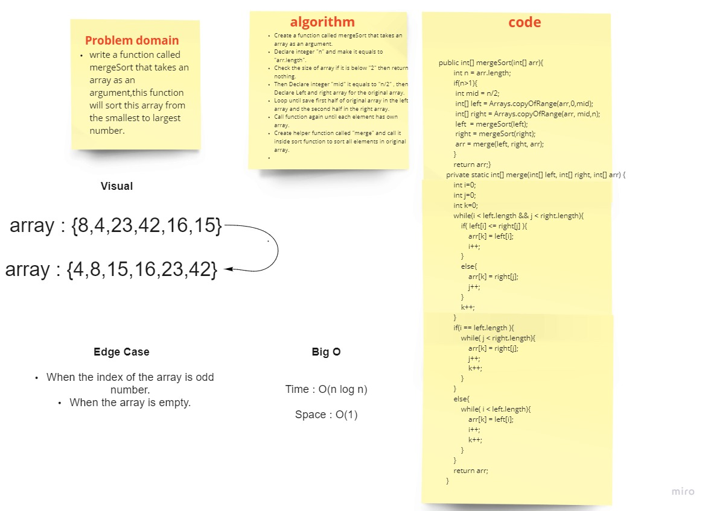

# Merge Sort 

# Challenge Summary

* Write a function that take an array as an argument and sort it using Marge sort algorithm then return the sorted array. 

## Whiteboard Process

## Approach & Efficiency

***Merge Sort:***

Time : O(n log n)

Space : O(1)
