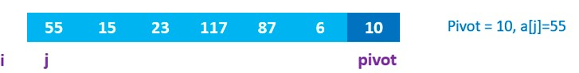
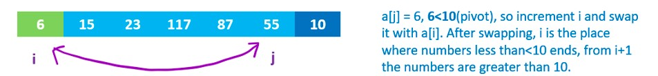
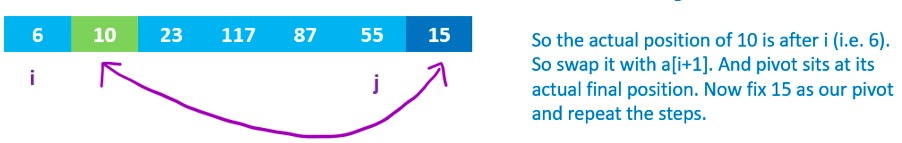
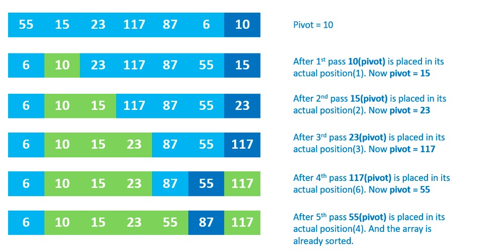

# Quick Sort Blog

## In this article will trace and explain how Quick sort works:

## Quick Sort: 

Like **Merge Sort**, `QuickSort` is a ***Divide and Conquer algorithm***. It picks an element as `pivot` and partitions the given array around the picked `pivot`. There are many different versions of `quickSort` that pick `pivot` in different ways. 

1. Always pick first element as `pivot`.
2. Always pick last element as `pivot` (implemented below)
3. Pick a random element as `pivot`.
4. Pick median as `pivot`.

The **key** process in quickSort is `partition()`. Target of partitions is, given an array and an element x of array as `pivot`, put x at its correct position in sorted array and put all smaller elements (smaller than x) before x, and put all greater elements (greater than x) after x. ***All this should be done in linear time***.


## Pseudocode:

```
ALGORITHM QuickSort(arr, left, right)
    if left < right
        // Partition the array by setting the position of the pivot value 
        DEFINE position <-- Partition(arr, left, right)
        // Sort the left
        QuickSort(arr, left, position - 1)
        // Sort the right
        QuickSort(arr, position + 1, right)

ALGORITHM Partition(arr, left, right)
    // set a pivot value as a point of reference
    DEFINE pivot <-- arr[right]
    // create a variable to track the largest index of numbers lower than the defined pivot
    DEFINE low <-- left - 1
    for i <- left to right do
        if arr[i] <= pivot
            low++
            Swap(arr, i, low)

     // place the value of the pivot location in the middle.
     // all numbers smaller than the pivot are on the left, larger on the right. 
     Swap(arr, right, low + 1)
    // return the pivot index point
     return low + 1

ALGORITHM Swap(arr, i, low)
    DEFINE temp;
    temp <-- arr[i]
    arr[i] <-- arr[low]
    arr[low] <-- temp
```

## Trace:

Sample Array: `[55,15,23,117,87,6,10]`

starting by pass the array and the left and right of this array (frist and last indices) to the method => `quickSort([55,15,23,117,87,6,10], 0, 6)`

### step 1:



### step 2:


### step 3:


### step 4:


### step 5:



### step 6:



### result:




## Efficency

* Time complexity:

`Worst Case:` `O(n^2)` The worst case occurs when the partition process always picks greatest or smallest element as pivot. If we consider above partition strategy where last element is always picked as pivot, the worst case would occur when the array is ***already sorted*** in increasing or decreasing order, because each time will cut only the pivot and return the array without the pivot.

`Best Case:` `O(nlogn)` The best case occurs when the partition process always picks the middle element as pivot, because each time will divide the array into almost two equal halves.

* Space:

The space complexity is calculated based on the space used in the recursion stack. The worst case space used will be `O(n)`.
where getting a sorted list, we need to make n recursive calls.