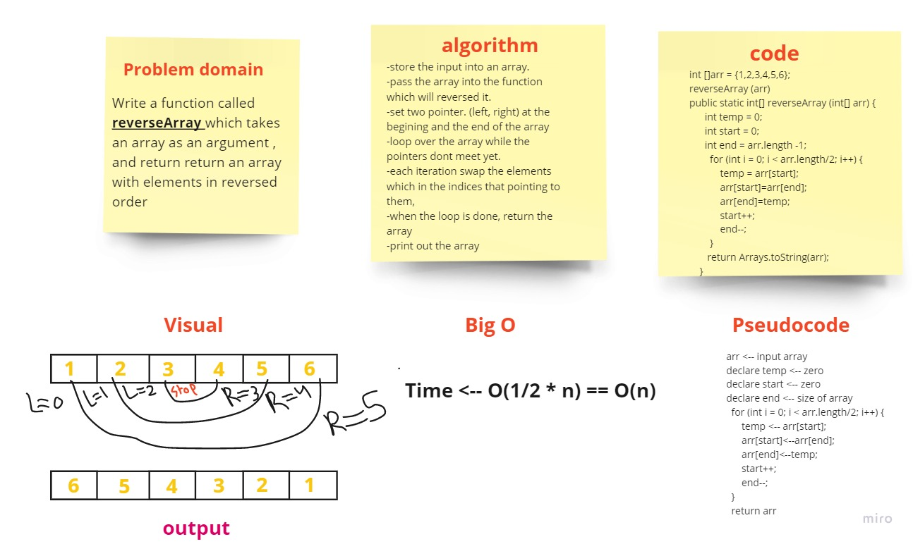

# Reverse an Array

print out an array in reverse order

## Approach & Efficiency

I used two pointers to replace the elements inside the array and go through it until the two pointers meet each other

## Whiteboard Process

