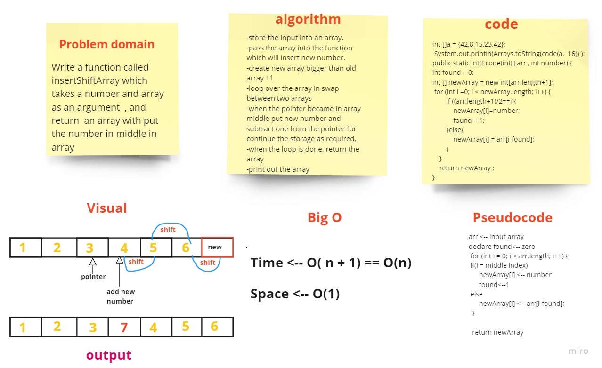

# Reverse an Array

print out an array  insert new number in array middle.

## Approach & Efficiency

I used a pointer to know middle index  to replace the elements inside this index by new item 
then shift items until the pointer reaches the end

## Whiteboard Process

