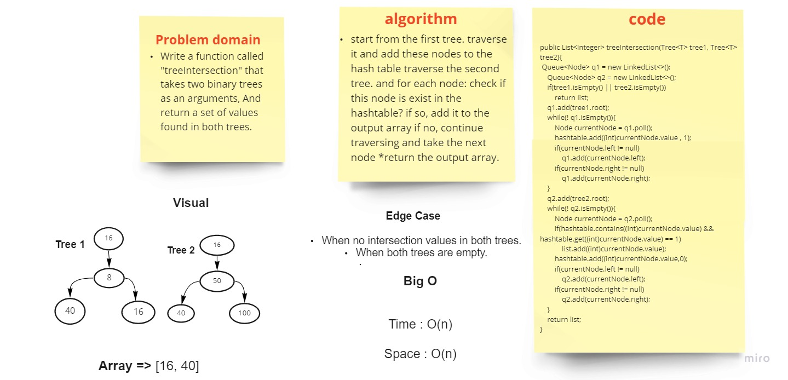
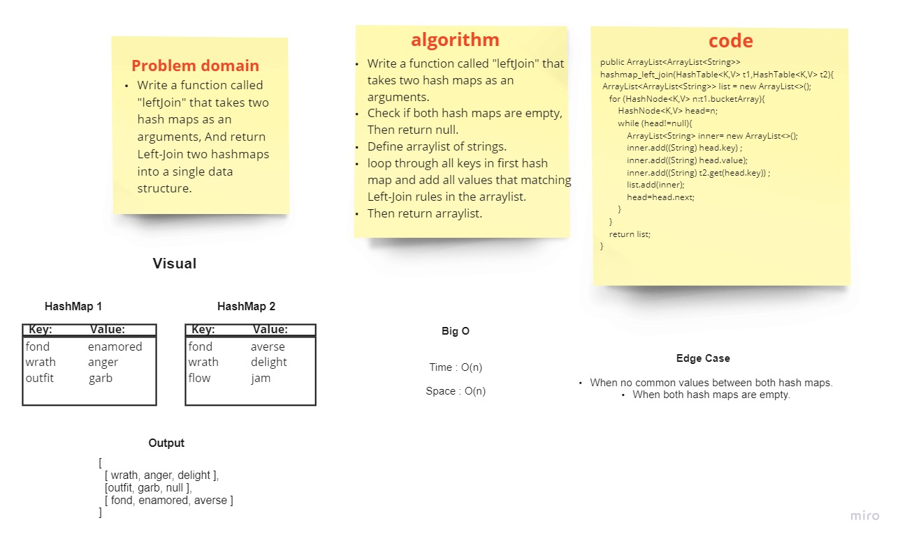

Implement a hashtable to store (key, value) pairs and retrieve the value in a fast way.

## Challenge

write the Java code to implement the hashtable and all its methods( add, get, contains, hash)
to store and retrieve data from this data structure in time complexity `O(1)`
where its method must do the following:

* `add`: takes in both the key and value. This method should hash the key, and add the key and value pair to the table, handling collisions as needed.
* `get`: takes in the key and returns the value from the table.
* `contains`: takes in the key and returns a boolean, indicating if the key exists in the table already.
* `hash`: takes in an arbitrary key and returns an index in the collection

## Approach & Efficiency

* ***Approach:***

Create an array of linked lists.. (buckets)of size `99` to hold the table in it

`hash(key):`

take a key as argument
calculate the sum for the ASCII code of each character in the key 
multibly the sum with `599`, where 599 is a prime number.
take the modulu of the result on the size of buckets:  `( result % 99 )`
return the final result ( index )

`add(key,value):`

hash the key.. using `hash` method 
go to the index returned from hash method in the buckets array.
check if the key is exist in the linked list which is inside the current bucket
if exist.. update the value of this key
if not .. add the pair(key, value) to the linked list

`get(key):`
hash the key.. using hash method 
go to the index returned from hash method
if the key is exist in this bucket.. return its value.
if not .. return null.

`contains(key):`
hash the key.. using hash method 
go to the index returned from hash method
if the key is exist in this bucket.. return true otherwise.. return false.

* ***Efficiency:***

***space: O(N)***

where n is the size of the array of buckets.

***time:*** 

* for add, get, contains:
  * average time : `O(1)`
  * worst case : `O(n)` "when the all keys is hashed to the same index."
* for hash: `O(1)`

# hashmap-repeated-word

Write a function that accepted a string parameter which  finds the first word to occur more than once in a string and return a string.

`repeatedWord(key):`

***space: O(N)***

***time:***

* for repeatedWord: `O(n^2)`

## Whiteboard Process

###### [back to main list of challenges](https://github.com/MHD22/data-structures-and-algorithms-401#readme)

# Tree Intersection

# Challenge Summary

find the common values in two binary trees.

## Approach & Efficiency

***Find common values in 2 binary trees:***

* start from the first tree.. traverse it and add these nodes to the hash table
* traverse the second tree.. and for each node:
* check if this node is exist in the hashtable?
  * if so, add it to the output array
  * if no, continue traversing and take the next node
* return the output array.

***Efficiency:***

**space:**

* first, we need space: `O(w)` to traverse the tree using `BFS`, where `w` is the max number of nodes in the same level,

* we need space: `O(h)` for `hashtable`, where `h` is the size of the hashtable, in my case is 100.

* and we need `O(n)` space for find the common vlaues, where `n` is the number of nodes in the tree ( the smallest tree if they weren't equal in the size), because in the worst case.. the whole tree will be common with the other one
  So, at all we need `spacd O(w+h+n)`

* **time:**

* we need `O(n)` time to traverse the tree.
  the time for adding and check the existence of keys is constant `O(1)` so, the time is `O(n)`

## Whiteboard Process

------------------------------------
# Hashmap LEFT JOIN

# Challenge Summary

Implement a simplified LEFT JOIN for 2 Hashmaps.

## Whiteboard Process

