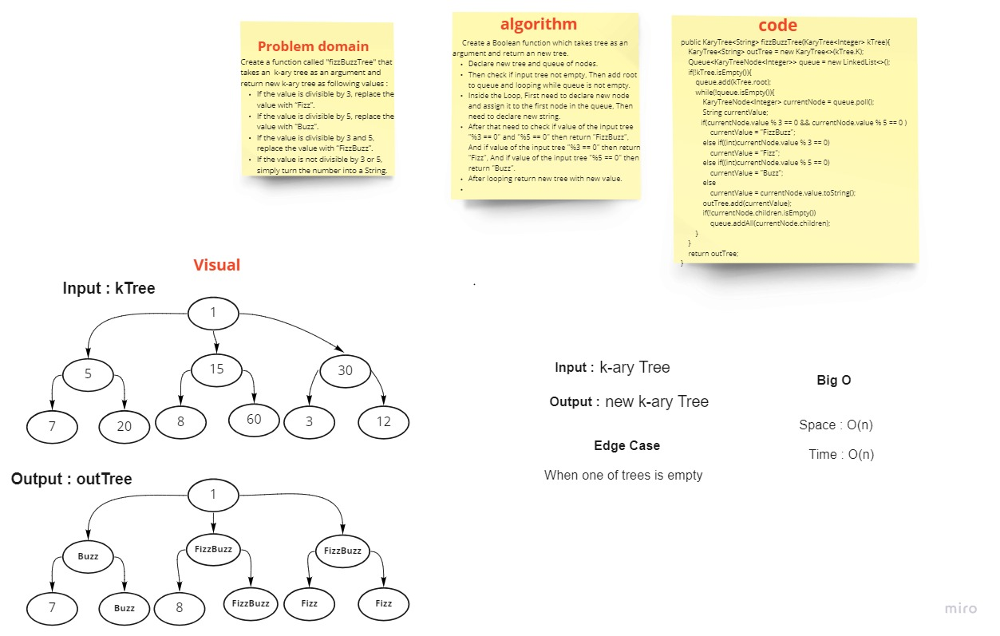

# Binary Tree / Binary Search Tree
<!-- Short summary or background information -->
- Binary Tree: A rooted binary tree, whose internal nodes each store a key; Each having two distinguished sub-trees (left and right)

## Challenge
<!-- Description of the challenge -->
- Create a BinaryTree class
    - Define a method for each of the depth first traversals called, `preOrder`, `inOrder`, and `postOrder` which returns an array of the values, ordered appropriately

- Create a BinarySearchTree class
    - Define a method named `add` that accepts a value, and adds a new node with that value in the correct location in the binary search tree.
    - Define a method named `contains` that accepts a value, and returns a boolean indicating whether or not the value is in the tree at least once.

## Approach & Efficiency
<!-- What approach did you take? Why? What is the Big O space/time for this approach? -->

# Trees: FindMaximumValue

# Challenge Summary

Implement a method to find the max value of a binary tree.

## Challenge Description

Need add the following method:

* `finMaximumValue(root)`
  this method should return an integer number which is the max value of the tree.

## Approach & Efficiency

***find-maximum-value***

**Apply the DFS to find the max value :**

* start from the root,findMax(root)
* set the max vlue is the root
* if the root is a leaf, `return` the value of the root.
* else,
  * if the root has left child => left = findMax(root.left)
  * if the root has right child => right = findMax(root.right)
  * if the left value > max => max = left
  * if the right value > max => max = right
  * return max value

## Solution

# Trees: Breadth First Search Traversal method

[Source code =>](https://github.com/MHD22/data-structures-and-algorithms-401/blob/main/Data-Structures/tree/app/src/main/java/tree/BinaryTree.java)

# Challenge Summary

Implement a method to traverse the binary tree in A BFS order.

## Challenge Description

Need add the following method:

* `breadthFirstSearch()`
  this method should return list which contain the all values of the tree in the BFS order.

## Approach & Efficiency

***Breadth First Search (BFS):***

* create an empty queue.
* add the root to the queue
* start loop on the queue while the queue is not empty.
* each time, dequeue the front of the queue and check if this node has a right and left children.
* If so, enqueue the children which found onto the queue.
* keep looping until the queue will be empty

## Solution

